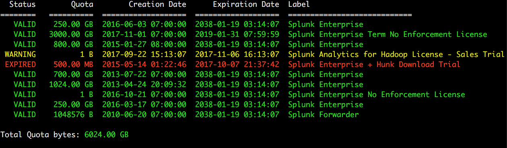

# View Splunk Licenses

A CLI Script to show pretty-printed Splunk License Data in a human-readable format.

This servers as a wrapper for `splunk list licenses`, but adds a few enchancements:

- Bytes are converted into MB and GB
- Total quota bytes are displayed at the end of the run, in MB/GB format
- Dates are converted into human-readable formats
- Color coding is used so expired licenses show up in RED
- Any license that expires in less than 30 days will show up in YELLOW
- Most importantly, output is 1 line per license instead of 50+ lines per license.

## Requirements

- Python
- A running version of Splunk 6.x or greater
- Admin access to Splunk

Note This script will attempt to find your Splunk installation--but if it cannot,
just set the environment variable SPLUNK_HOME and that will be checked.

## Usage

- Run the script: `./get-splunk-licenses.py`
- Enter your admin username and password if prompted

## Sample Output

## Comments or Feedback

Feel free to email them to me (Douglas_Muth@comcast.com) or open a bug here.

Enjoy!

